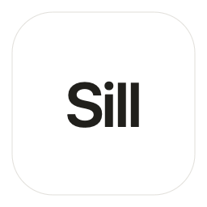

<div align="center">



# Sill

**A small panel that holds the things you're not ready to send yet.**

[](LICENSE)
[](#requirements)
[](#install)

</div>

---

You ask an AI something. While it's generating, three more thoughts arrive — a follow-up
question, a line worth keeping, an idea for later. Acting on any of them means interrupting
what's running, so you hold them in your head, and by the time the answer lands two are gone.

Sill is where they go instead. Copy something and tap **Shift twice**; it lands in a panel at
the edge of your screen without your cursor ever leaving the conversation. Type a prompt
straight into the panel while the AI is still talking. When you're ready, select what you
want, press `⇧⌘C`, and paste — they're copied as a numbered list **and ticked off in the same
motion.**

That last part is the point. Every tool in this category becomes a graveyard, because nothing
in them makes finished things go away. Sill is built to empty: ticking something off removes
it from the panel, and clearing moves it to an archive you can still read and restore from.

Everything lives in **plain markdown files** you own. No database, no account, no sync, and
no network code anywhere in the app.

Sill was inspired by [Copper](https://shadcn.com/copper) by shadcn, which explores the same
idea beautifully. Sill is an independent, free, open-source take — different code, different
design, different tradeoffs. If you like the idea, go look at Copper too.

## Requirements

macOS 14 (Sonoma) or later. Universal — Apple silicon and Intel.

## Install

> **There is no download yet.** A notarized `.zip` is coming shortly. Until then, build it —
> it takes about fifteen seconds and needs nothing but Xcode's command line tools.

### Build from source

Two upsides over a download, both real: locally compiled apps are never quarantined by macOS,
so there is no Gatekeeper warning at all, and you can read every line of what you're running.

```bash
git clone https://github.com/dawoodabdullah010/sill.git
cd sill
./build.sh
cp -R build/Sill.app /Applications/
open /Applications/Sill.app
```

You need Xcode or the Command Line Tools (`xcode-select --install`). Nothing else — there are
no dependencies, so `swift build` fetches nothing.

**If you plan to rebuild often and use Accessibility, run this once first:**

```bash
./tools/fix-signing.sh
```

macOS ties the Accessibility permission to a code-signing identity. An ad-hoc signature's
identity is a hash of the binary, so it changes with every build and the grant silently dies —
the System Settings toggle keeps *looking* on while the app keeps asking. The script makes a
free self-signed certificate so the identity stays stable. Then build with
`SILL_SIGN_IDENTITY="Sill Dev" ./build.sh`.

### Download a release

Not available yet. A build signed and notarized by Apple — which opens with no warning and,
more importantly, keeps its Accessibility permission across updates — will appear under
[Releases](https://github.com/dawoodabdullah010/sill/releases) soon. Watch the repo if you'd
rather wait for it than compile.

## How it works

Sill runs in the menu bar with no Dock icon. The panel docks to the right edge of whichever
screen your pointer is on; drag it anywhere and it remembers.

The panel is a **nonactivating panel** — a window that floats above your work and accepts
typing *without* making Sill the frontmost app. Your caret stays in the chat you were in.
That single AppKit behaviour is why Sill is native Swift and not an Electron app.

Two kinds of item, distinguished by where they came from:

- A **note** is something you captured from somewhere else.
- A **prompt** is something you typed into the panel yourself.

Type `# Reading` into the composer to start a new list.

## Shortcuts

| Shortcut | What it does |
|---|---|
| `⇧` `⇧` | Capture the selection (or whatever you last copied) |
| `⇧⌘C` | Copy the selection as a numbered list **and tick it off** |
| `⌘C` | Copy without ticking off |
| `⌘↩` | Send back into the app you came from |
| `Space` | Mark done |
| `↩` | Edit the selected item |
| `→` `←` | Expand / collapse a long item |
| `↑` `↓` | Move through the list |
| `⌘`-click / `⇧`-click | Add to the selection / select a range |
| `⌫` | Delete (asks first for more than one) |
| `⌘Z` / `⇧⌘Z` | Undo / redo |
| `⌘F` | Search · `⌘K` one list at a time · `⌘/` all shortcuts |
| `Esc` | Clear selection, then close |
| `# Name` `↩` | Start a new list |

Right-click any item for Copy, Copy as List, Mark as Done, Expand, Edit, Merge Notes, Send to
App, Back to source, Move to, and Delete. Drag items to reorder.

## The file format

Your captures live in `~/Library/Application Support/Sill/Sill.md`, and you can point Sill at
any folder you like — an Obsidian vault, a git repo — from `···` → **Choose Notes Folder…**

```markdown
# Inbox

<!-- sill: c=2026-08-01T14:55:54Z | app=Claude | bundle=com.anthropic.claudefordesktop -->
- [ ] The bit of the answer that was actually worth keeping.
  Continuation lines are indented two spaces.

* [ ] Ask it to redo this with the constraint relaxed

<!-- sill: c=2026-07-30T09:02:11Z | app=Safari | url=https://example.com/post -->
- [ ] https://example.com/post
```

- `# Name` is a list.
- `- [ ]` is a **note** — something you captured.
- `* [ ]` is a **prompt** — something you typed.
- `[x]` means done.
- Two-space indented lines continue the item above.
- `<!-- sill: … -->` carries metadata: `c=` captured, `d=` completed, and `app=` / `bundle=` /
  `url=` for where it came from.

`-` and `*` are interchangeable bullets in markdown, so both render as ordinary checkboxes in
Obsidian and on GitHub — the note/prompt distinction rides on a character your editor already
ignores. Nothing is embedded in your text.

**Anything you write in the file yourself is kept.** Paragraphs, sub-headings, quotes — Sill
carries them through and writes them back where they were. It also watches the folder, so
editing the file in another app while Sill is running no longer loses your changes.

Cleared items move to `Sill-Archive.md`. They're never destroyed, and `···` → **Archive** lets
you read and restore them.

Sill writes to a temporary sibling and swaps it into place, so a crash mid-write can't truncate
your file. If the file ever becomes unreadable, Sill stops saving entirely rather than
overwriting it with an empty list.

## Privacy

**Sill contains no networking code.** Not "we don't collect data" — there is no code in this
repository capable of making a network request. Check it yourself:

```bash
grep -rniE 'URLSession|NSURLConnection|CFNetwork|NWConnection|socket|http' Sources/
```

The only `URL`s are `file://` paths to your notes, the `x-apple.systempreferences:` link that
opens System Settings, and URLs *you* captured — opened in your browser only when you click
them. There are no dependencies, so there's no third-party code to audit either.

## Permissions

**Sill works on first launch with nothing granted.**

- **Without any permission** — press `⌘C` yourself, then tap Shift twice. Sill reads the
  clipboard.
- **With Accessibility** (optional) — Sill presses `⌘C` for you, so Shift-Shift grabs the
  selection directly; it reads the URL of the page you captured from, so "Back to source"
  returns you to the exact conversation; and `⌘↩` pastes back into the app you came from.

Accessibility is the broadest permission macOS grants, and you should be sceptical of any app
asking for it. Sill uses it for exactly three things — reading the current selection,
synthesising `⌘C`/`⌘V`, and reading a browser's address bar — all in
[`Capture.swift`](Sources/Sill/Capture.swift). It asks at most once per launch, never on first
run, and never blocks a capture on your answer.

Sill does **not** use Input Monitoring. Detecting a double-tap of Shift needs only modifier-key
events, which macOS delivers without permission — so Sill cannot read what you type, with or
without Accessibility.

## Building

```bash
swift build                                                  # debug
./build.sh                                                   # universal release .app
swiftc -o /tmp/t tools/roundtrip-test.swift Sources/Sill/Model.swift   # store tests
```

| Path | What's in it |
|---|---|
| `Sources/Sill/Model.swift` | The markdown format — parser and serializer |
| `Sources/Sill/Store.swift` | Items, lists, archive, undo, atomic writes, file watching |
| `Sources/Sill/Capture.swift` | Reading the selection, provenance, sending text back |
| `Sources/Sill/DoubleShift.swift` | The Shift-Shift gesture |
| `Sources/Sill/Panel.swift` | The nonactivating panel and its placement |
| `Sources/Sill/PanelView.swift` | The SwiftUI interface |
| `tools/roundtrip-test.swift` | Regression tests — every case is a bug that lost data |

If you change `Model.swift` or `Store.swift`, add a case to the test file. Losing a character
there means silently losing someone's notes.

## Known limitations

- **Double-tapping Shift collides with JetBrains IDEs**, which bind it to Search Everywhere.
  Not rebindable yet — the next thing to fix.
- **No rich text.** Bold and italic from the source are flattened to plain text.
- **Lists can't be reordered from the UI** yet, though the code is there.
- **Not notarized** — see [Install](#install).
- **macOS only.** The nonactivating panel is the product, and it's an AppKit behaviour with no
  cross-platform equivalent.

## Contributing

Yes, please — see [CONTRIBUTING.md](CONTRIBUTING.md). The limitations above are the roadmap.

## License

MIT © 2026 Dawood Abdullah — see [LICENSE](LICENSE).

Built by [@mdam10x](https://x.com/mdam10x). Free, and staying free.
